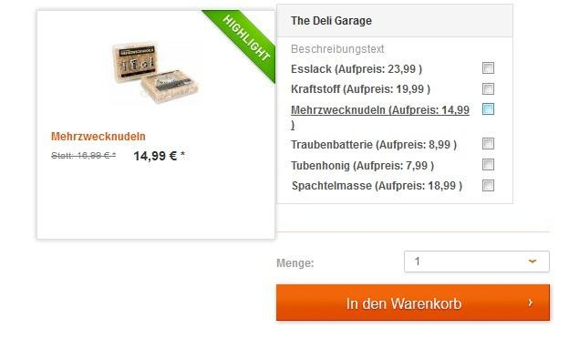
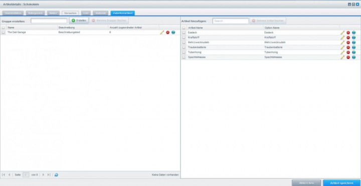

# SwagAccessory
> Working with Shopware version 4.0.7 to 5.1.1
> Higher versions may work either but were not tested.

## Description
This plugin makes it possible for customers to add multiple items to their shopping cart from single item detail page. 
A mouse-over effect displays a pop-up box is where the customer is able to select and send additional complimentary items to their shopping cart.
So simplify shopping for your customers—recommend accessories or other items from a similar category and effectively increase your sales at the same time.

## Images

---

## License

The MIT License (MIT). Please see [License File](LICENSE) for more information.
